# Video Portfolio — Футбольные навыки

Видеопортфолио с демонстрацией физической подготовки и технических навыков.

## Бег

### Бег 15 м

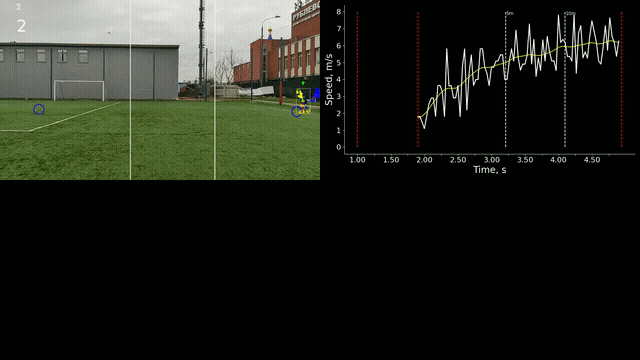

### Бег 30 м

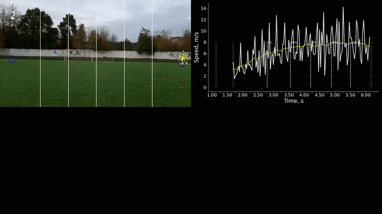

### Челночный бег

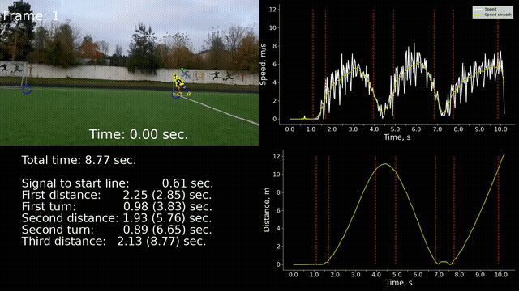

## Прыжки

### Прыжок в высоту

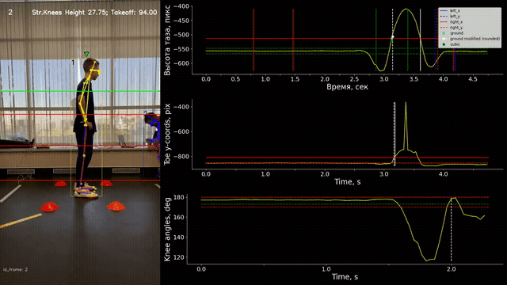

### Прыжок в длину с места

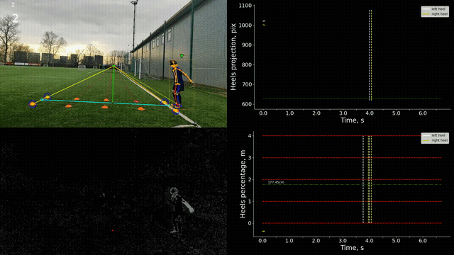

### Тройной прыжок в длину с места

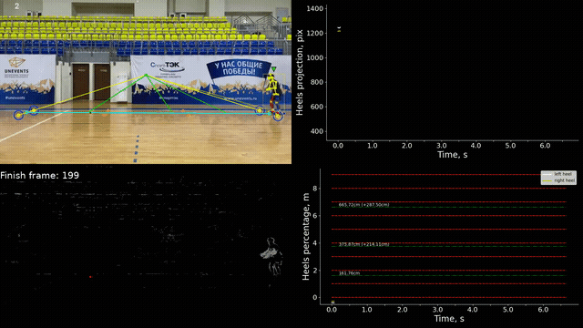

## Ведение мяча

### Ведение мяча 15 м

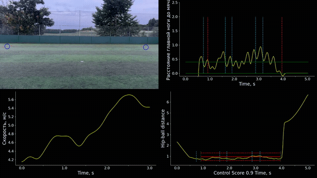

### Ведение мяча 3×10 м

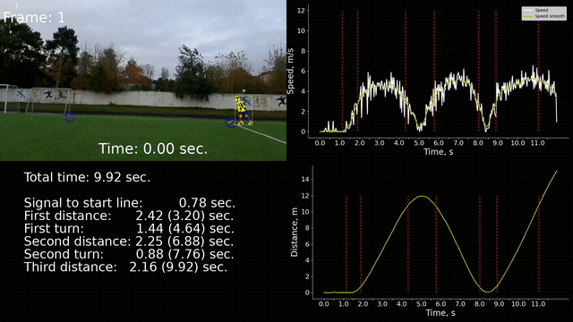

### Ведение мяча с изменением направления

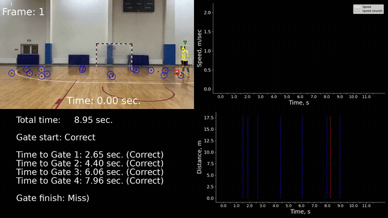

## Удары и передачи

### Передача правой

### Удар на точность

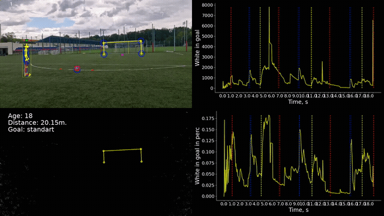

### Жонглирование ударами головой

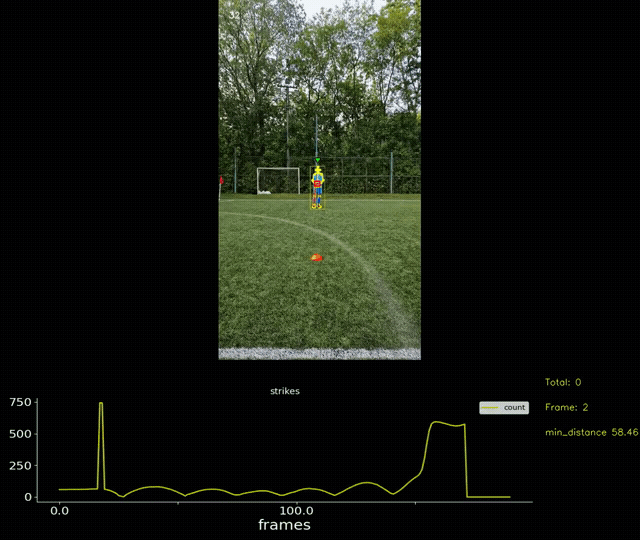

## Игра 1 на 1 / 1 на 2

### Один на один

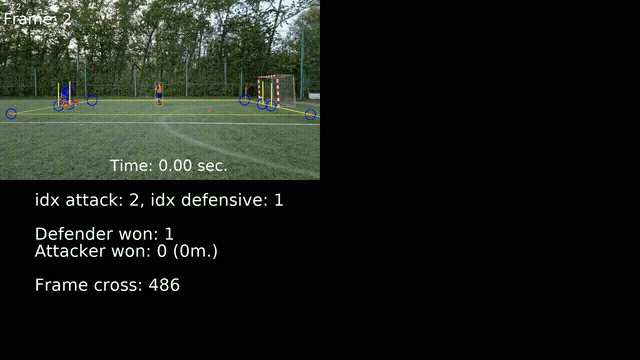

### Один против двух

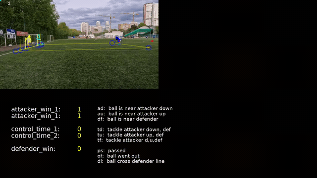

### Один отбирает у двух

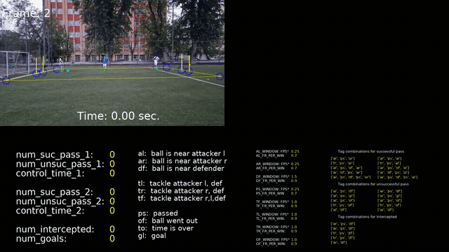

## Оператор

### Оператор

## Футбол Зенит

### Футбол Зенит

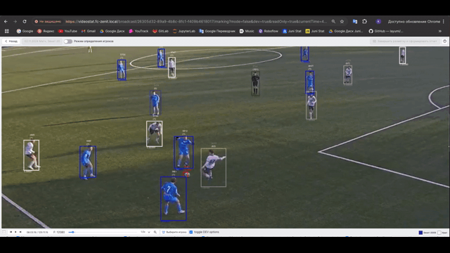

## Список всех GIF

| № | Название | Файл |
|---|----------|------|
| 1 | Бег 15 м | [beg_15.gif](gifs/beg_15.gif) |
| 2 | Бег 30 м | [beg_30.gif](gifs/beg_30.gif) |
| 3 | Челночный бег | [chelnocny_beg.gif](gifs/chelnocny_beg.gif) |
| 4 | Прыжок в высоту | [pryzhok_v_vysotu.gif](gifs/pryzhok_v_vysotu.gif) |
| 5 | Прыжок в длину с места | [pryzhok_v_dlinu_s_mesta.gif](gifs/pryzhok_v_dlinu_s_mesta.gif) |
| 6 | Тройной прыжок в длину с места | [troynoy_pryzhok_v_dlinu_s_mesta.gif](gifs/troynoy_pryzhok_v_dlinu_s_mesta.gif) |
| 7 | Ведение мяча 15 м | [vedenie_myacha_15.gif](gifs/vedenie_myacha_15.gif) |
| 8 | Ведение мяча 3×10 м | [vedenie_myacha_3_10.gif](gifs/vedenie_myacha_3_10.gif) |
| 9 | Ведение мяча с изменением направления | [vedenie_myacha_s_izmeneniem_napravleniya.gif](gifs/vedenie_myacha_s_izmeneniem_napravleniya.gif) |
| 10 | Передача правой | [peredacha_pravoy.gif](gifs/peredacha_pravoy.gif) |
| 11 | Удар на точность | [udar_na_tochnost.gif](gifs/udar_na_tochnost.gif) |
| 12 | Жонглирование ударами головой | [zhonglirovanie_udarami_golovoy.gif](gifs/zhonglirovanie_udarami_golovoy.gif) |
| 13 | Один на один | [odin_na_odin.gif](gifs/odin_na_odin.gif) |
| 14 | Один против двух | [odin_protiv_dvuh.gif](gifs/odin_protiv_dvuh.gif) |
| 15 | Один отбирает у двух | [odin_otbiraet_u_dvuh.gif](gifs/odin_otbiraet_u_dvuh.gif) |
| 16 | Оператор | [operator.gif](gifs/operator.gif) |
| 17 | Футбол Зенит | [futbol_zenit.gif](gifs/futbol_zenit.gif) |
